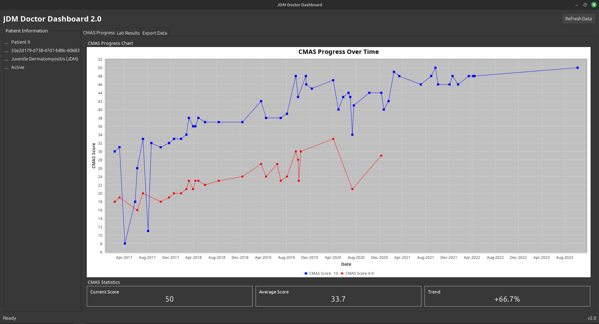
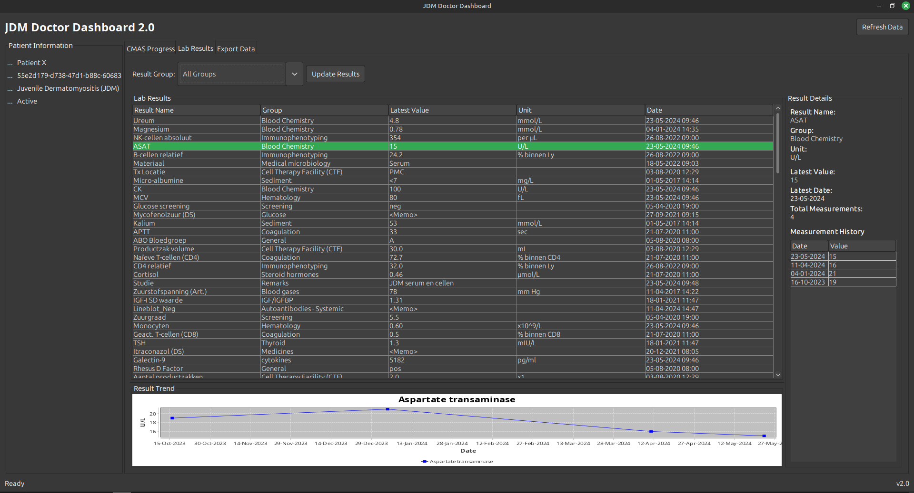

# JDM Doctor Dashboard

A Java application for monitoring children with Juvenile Dermatomyositis (JDM) through visualization of CMAS scores and laboratory results.

## Overview

The JDM Doctor Dashboard is designed to help doctors track the progress of patients diagnosed with Juvenile Dermatomyositis, a rare autoimmune disease that affects children. The application provides visualizations and analytics for CMAS (Children's Myositis Assessment Scale) measurements and laboratory test results.





## Features

- **Patient Information Display**: Basic patient details and status
- **CMAS Progress Tracking**: 
  - Time series charts showing CMAS scores over time
  - Filtering by CMAS category and time range
  - Statistical analysis including averages and trends
- **Laboratory Results Management**:
  - Organized view of lab results by category
  - Trend visualization for numeric values
  - Detailed history for each measurement
- **Data Export**:
  - Export to CSV and Excel formats
  - Customizable export options
  - Comprehensive patient reports
- **Additional Visualization**:
  - Correlation charts between CMAS scores and biomarkers
  - Statistics and trend analysis

## Getting Started

### Prerequisites

- Java 11 or higher
- Maven for building the project
- Python 3.6+ (if you need to clean the original CSV files)

### Installation

1. Clone the repository:
   ```
   git clone https://github.com/SnakeyRoad/jdm-doctor-dashboard.git
   cd jdm-doctor-dashboard
   ```

2. Data preparation:
   - The project includes a Python script (`clean_csv_files.py`) for cleaning the original CSV data
   - Run the script to process the raw data:
     ```
     python clean_csv_files.py
     ```
   - This creates a `cleaned_csv` directory with properly formatted CSV files
   - Copy these cleaned files to the `data` directory:
     ```
     cp cleaned_csv/* data/
     ```

3. Build the project:
   ```
   mvn clean package
   ```

4. Run the application:
   ```
   java -jar target/jdm-doctor-dashboard-1.0-SNAPSHOT-jar-with-dependencies.jar
   ```

## Usage

### Dashboard Navigation

The dashboard consists of several tabs:

1. **CMAS Progress**: View charts of CMAS scores over time
   - Use filters to narrow down by category or time period
   - Statistics are displayed at the bottom

2. **Lab Results**: Browse laboratory test results
   - Filter by result group
   - Click on a result to see detailed history and trend chart

3. **Export Data**: Export patient data in various formats
   - Select which data types to export
   - Choose between CSV and Excel formats

### Data Import

On first run, the application automatically creates a SQLite database and imports data from the CSV files in the `data` directory.

## Data Processing

### CSV Cleaning Process

The project includes a custom Python script (`clean_csv_files.py`) that prepares the raw CSV data for import. This script:

1. **Standardizes DateTime formats** - Ensures consistent DD-MM-YYYY HH:MM format
2. **Normalizes value representations** - Handles international number formats (comma vs. decimal point)
3. **Removes empty rows and whitespace** - Cleans up inconsistencies in the data
4. **Handles special characters** - Prevents encoding issues in the database
5. **Restructures CMAS data** - Converts from wide to long format for better analysis

Example of cleaning implementation:

```python
def clean_datetime(datetime_str):
    """Clean and standardize datetime strings"""
    if not datetime_str or datetime_str.isspace():
        return ""
    
    # Remove quotes, spaces, and newlines
    clean_str = datetime_str.strip().replace('"', '').replace('\n', '')
    
    # Remove decimal points from time
    clean_str = re.sub(r'\.\d+$', '', clean_str)
    
    # Insert space between date and time if missing
    if re.match(r'^\d{2}-\d{2}-\d{4}\d{2}:\d{2}$', clean_str):
        clean_str = re.sub(r'(\d{2}-\d{2}-\d{4})(\d{2}:\d{2})', r'\1 \2', clean_str)
    
    return clean_str
```

The script ensures data integrity before importing it into the SQLite database used by the application.

## Project Structure

The application follows the Model-View-Controller (MVC) architecture:

```
jdm-doctor-dashboard/
├── clean_csv_files.py       # Data cleaning script
├── src/
│   ├── main/
│   │   ├── java/com/jdm/
│   │   │   ├── models/      # Data objects
│   │   │   ├── dao/         # Data Access Objects
│   │   │   ├── controllers/ # Business logic
│   │   │   ├── ui/          # User interface components
│   │   │   ├── utils/       # Utility classes
│   │   │   └── App.java     # Main entry point
│   │   └── resources/
│   └── test/                # Unit tests
├── data/                    # Cleaned CSV data files
├── images/                  # Screenshots and images
├── diagrams/                # UML and other diagrams
└── pom.xml                  # Maven configuration
```

## Diagrams

The project includes several diagrams in the `diagrams` directory:
- Class Diagram: Shows the structure and relationships of Java classes
- ERD (Entity-Relationship Diagram): Illustrates the database schema
- Use Case Diagram: Describes the system's functionality from a user perspective

Source code for these files was preserved locally as *.puml files for later editing/additions.

## Application Components

### Main Components
1. **App.java**: Main entry point that initializes the database and UI
2. **DashboardPanel.java**: Main UI container that holds all other panels
3. **PatientInfoPanel.java**: Displays patient information
4. **CMASChartPanel.java**: Shows CMAS progression charts and statistics
5. **LabResultPanel.java**: Displays lab results and their trends
6. **ExportPanel.java**: Provides data export functionality

### Model Classes
1. **Patient.java**: Represents a JDM patient
2. **CMAS.java**: Represents a CMAS measurement
3. **LabResultGroup.java**: Represents a group of lab results
4. **LabResult.java**: Represents a lab result type
5. **Measurement.java**: Represents an individual lab measurement

### Data Access Objects
1. **DatabaseManager.java**: Handles database connections and initialization
2. **PatientDAO.java**: Manages patient data operations
3. **CMASDAO.java**: Manages CMAS data operations
4. **LabResultGroupDAO.java**: Manages lab result group operations
5. **LabResultDAO.java**: Manages lab result operations
6. **MeasurementDAO.java**: Manages measurement operations

### Controllers
1. **DashboardController.java**: Handles overall application control
2. **PatientController.java**: Controls patient operations
3. **CMASController.java**: Controls CMAS operations
4. **LabResultController.java**: Controls lab result operations

### Utility Classes
1. **CSVImporter.java**: Imports data from CSV files
2. **DateUtils.java**: Handles date operations
3. **ExportUtils.java**: Handles data export operations

## User Workflow

1. **Launch Application**: The dashboard loads with the patient's information
2. **CMAS Analysis**: View CMAS scores over time with trend analysis
   - View statistics including current score, average, and trend
3. **Lab Results Analysis**: Browse lab results organized by category
   - View detailed history and trends for specific tests
   - Analyze numeric results with charts
4. **Data Export**: Export patient data for reporting
   - Choose between CSV and Excel formats
   - Select specific data types to export
   - Review export logs

## Benefits for Doctors

1. **Efficient Monitoring**: Quick visualization of patient progress
2. **Data-Driven Decisions**: Trend analysis helps in treatment adjustments
3. **Comprehensive View**: All patient data in one dashboard
4. **Easy Reporting**: Export capabilities for sharing with colleagues
5. **Research Support**: Data available for research on JDM

## Technical Details

- **Database**: SQLite for local data storage
- **UI Framework**: Java Swing
- **Charting**: JFreeChart for data visualization
- **Build Tool**: Maven
- **Data Cleaning**: Custom Python script for data preparation

## Future Enhancements

1. User authentication and role-based access
2. Support for multiple patients
3. Integration with electronic health record systems
4. Advanced analytics using machine learning
5. Mobile companion app for patients to track exercises and symptoms
6. Real-time alerts for concerning measurement trends
7. Integration with biomarker analysis tools

## Contributing

1. Fork the repository
2. Create your feature branch (`git checkout -b feature/amazing-feature`)
3. Commit your changes (`git commit -m 'Add some amazing feature'`)
4. Push to the branch (`git push origin feature/amazing-feature`)
5. Open a Pull Request

## License

None as of yet. Copyright by The Snakey Road 2025
## Acknowledgments

- This project was created as part of a software engineering course
- Special thanks to the JFreeChart team for their excellent charting library

